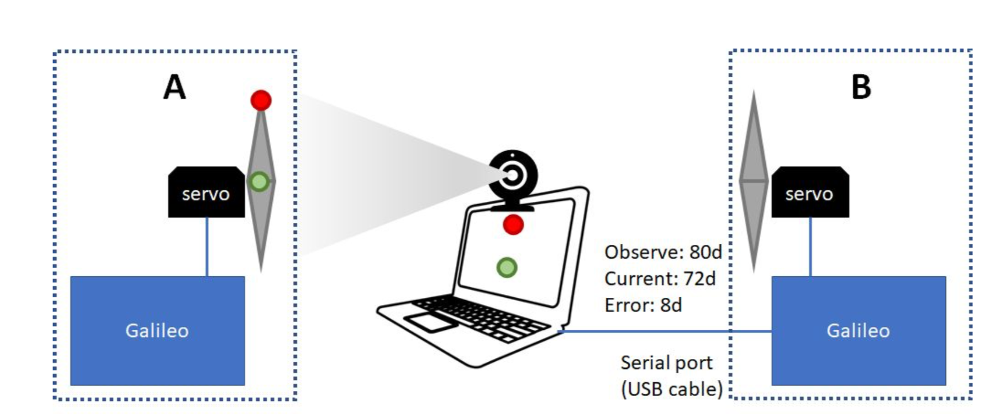

# PID Controlled Mimicking Robot

A mimicking robot is a special kind of robot. It can mimic the movement of the reference subject. For example, the robot arm used in microsurgery, or the fighting robot in the Pacific Rim movie.

This project implements a mimicking robot which has a PID (Proportional–Integral–Derivative) controller to control the Galileo board and the servo to mimic the movement of the servo controlled by the other Galileo board.

 

Project Flow:

1. Calibrated the web-camera with three locations of the servo and generated a perspective projection matrix from the observed and true angular positions.
2. Controlled the Mimicking Servo on the Galileo Board by setting its angular velocity in range of ±10 from the difference calculated after perspective projection of the reference servo and the mimicking servo and communicated the same serially.
3. Controlled the Servo with different combinations of components, P, PI, and PID, with PI being the best performer, followed by PID, followed by P.
